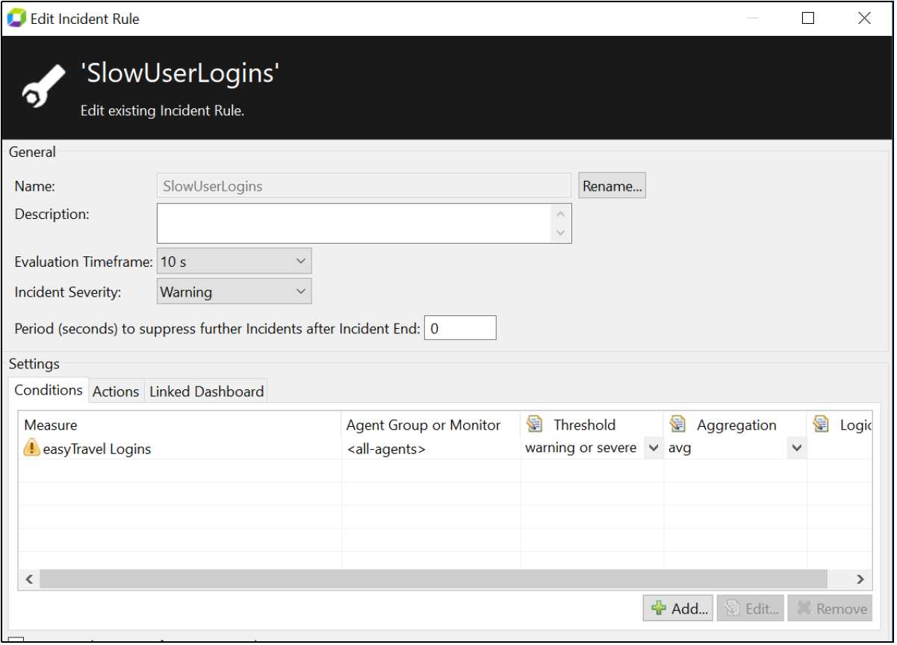
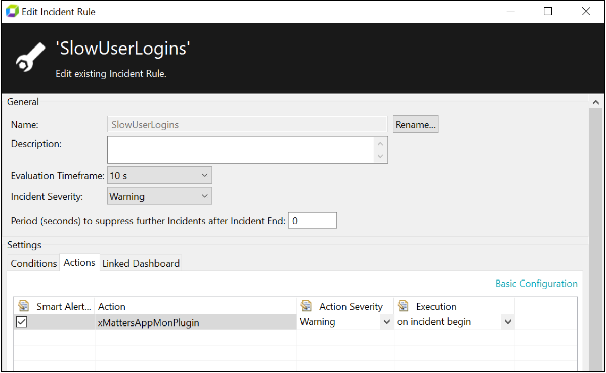
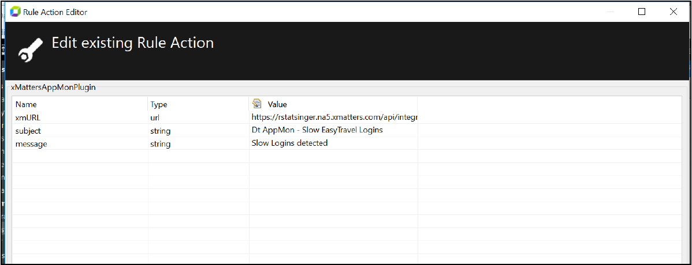

# xMatters Plugin

**Description** 
This plugin allows Dynatrace AppMon incidents to be forwarded to xMatters

**Name and Version** 
xMatters Plugin Version 1.0.8

**Compatible with**
This plugin has been built and tested against AppMon 7.0. It has not been tested against earlier versions

**Author** 
Robert Statsinger

**License**
[Dynatrace BSD](https://community.dynatrace.com/community/download/attachments/5144912/dynaTraceBSD.txt)

**Support Level** 
[Not Supported](https://community.dynatrace.com/community/display/DL/Support+Levels)

**Download (latest version)** [com.xmatters.dtappmonplugin_1.0.8.jar](https://github.com/Dynatrace/Dynatrace-AppMon-xMatters-Plugin/releases/download/v1.0.8/com.xmatters.dtappmonplugin_1.0.8.jar)

## Description
This plugin allows Dynatrace AppMon incidents to be forwarded to xMatters

## Installation
Import the Plugin into the AppMon Server. For details, please refer to the Online Documentation on Plugin Management.

## Configuration

1. Select the Incident Rule(s) on which you wish to forward incidents to xMatters, and open the edit dialog. 
2. In the 'Actions' tab, ensure that the xMatters Plugin is added and set to fire 'on incident begin'. 
3. Ensure that the xmURL property is set to point to an inbound xMatters Integration 
4. Set specific Subject and Message properties appropriate to the specific AppMon Incident Rule The following screenshots show an example configuration:

An xMatters Communication Plan appropriate for this integration is available [here](https://github.com/rstatsinger/xMattersAppMonCommPlan). This
Comm Plan will let you set appropriate notification recipients for forwarded AppMon incidents and will
allow you to post a confirmation of the incident back into AppMon via its REST APIs.

